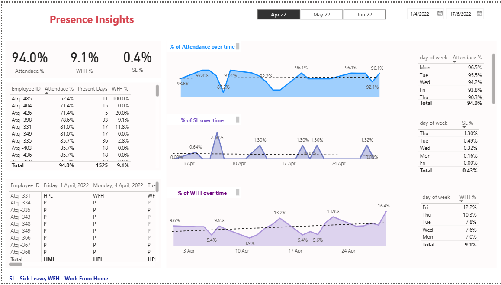

# HR Analytics Dashboard – Power BI

## 📊 Project Overview
This project provides insights into employee attendance by analyzing:
- **Attendance %**
- **Work From Home (WFH) %**
- **Sick Leave (SL) %**

The dashboard helps HR teams monitor workforce availability and plan events based on in-office presence.

---

## ✨ Features
- Interactive filters for **day and month** to track attendance patterns.
- Custom **DAX measures** for calculating presence, leave counts, and percentages.
- **Power Query** transformations to merge multiple Excel sheets with different structures using parameters.
- Trend analysis with tables and charts for better HR decision-making.

---

## 🧰 Tools & Technologies
- **Power BI** (DAX, Power Query)
- **Excel** (sample dataset – masked)

---

## 📂 Repository Contents
- `HR_Analytics_Dashboard.pbix` → Power BI dashboard file  
- `Attendance_Dataset_Masked.xlsx` → Sample dataset  
- `Dashboard_Screenshot.png` → Dashboard preview  
- `README.md` → Project documentation  

---

## 🚀 How to Use
1. Clone or download this repository.  
2. Open `HR_Analytics_Dashboard.pbix` in **Power BI Desktop**.  
3. If prompted, update dataset file paths.  
4. Use slicers (day/month) to explore insights.  

---

## 📸 Dashboard Preview

---

## 📝 Notes
- The dataset is masked for privacy.  
- If the `.pbix` file is l

